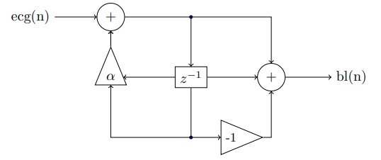

```{r setup, cache=F, echo=F, message=F, warning=F, tidy=F}
# CONFIGURACIÓN GENERAL
library(knitr)
options(width=100)
# Opciones generales chunks
opts_chunk$set(echo=TRUE, message=F, error=F, warning=F,
               comment=NA, dpi=100, tidy=F,
               cache.path='./cache/', fig.path='./figure/')

# options(xtable.type='html')
knit_hooks$set(inline=function(x) {
  if(is.numeric(x)) {
    round(x, getOption('digits'))
  } else {
    paste(as.character(x), collapse=', ')
  }
})
# knit_hooks$set(plot=knitr:::hook_plot_html)
```

```{r, include=F}
# Especificamos las librerías necesarias en esta lista
packages=c("tidyverse", "knitr", "ggplot2", "datasets", "RColorBrewer", "dplyr", "lubridate", "kableExtra", "ramify", "signal", "R.matlab")
# use this function to check if each package is on the local machine
# if a package is installed, it will be loaded
# if any are not, the missing package(s) will be installed and loaded
package.check <- lapply(packages, FUN=function(x) {
  if (!require(x, character.only=TRUE)) {
    install.packages(x, dependencies=TRUE,repos='http://cran.rediris.es')
    library(x, character.only=TRUE)
  }
})
# verify they are loaded
search()
```

\newpage

# 1. Pre-laboratorio

## 1.1. Sistemas discretos

1. Lee la ayuda (help) de las funciones que se van a utilizar.

2. Resuelve la ecuación en diferencias: y(n) = x(n) - 0.5y(n-1), x(n) = u(n)

- 1. Solución homogénea $y_h[n] = \sum_i K_ic_i^n$

- Consideramos x(n) = 0 y sustituimos y(m) por $c^m$

$\hspace{2cm}y(m) = x(m) - 0.5y(m-1), x(m) = u(m)$ 

$\hspace{2cm}c^m = - 0.5c^{m-1} \hspace{1cm} \rightarrow \hspace{1cm} c^m + 0.5c^{m-1} = 0$ 

$\hspace{2cm} c^{m-1} [ c + 0.5] = 0$

$\hspace{2cm}c + 0.5 = 0 \ \ \ \ \rightarrow \ \ \ \  c = -0.5$

$\hspace{2cm}y_h[n] = K_1 (-0.5)^n$

- 2. Solución particular $y_p[n] = B \ \cdot \ x[n]$

$\hspace{2cm} y_p[n] = B \ \cdot \ u(n)$

$\hspace{2cm} B \ \cdot \ u(n)= u(n) - 0.5 B\ \cdot \ u(n-1)$

- Para $n \geq 1$:

$\hspace{2cm} B = 1 - 0.5 B$

$\hspace{2cm} B + 0.5 B = 1$

$$1.5 B = 1 \hspace{1cm}  \rightarrow \hspace{1cm} B = \frac{1}{1.5} = \frac{2}{3} $$

$$y_p[n] = \frac{2}{3} \ \cdot \ u(n)$$

- Solución final.

$\hspace{2cm}\left.\begin{array}{c} y(n) = x(n) - 0.5y(n-1)\\ y(n)' = \frac{2}{3}  \ u(n) \ + K_1 (-0.5)^n  \end{array}\right\rbrace$

$\hspace{2cm} y(0) = y'(0)$

$\hspace{2cm} 1 - 0.5y(-1) = \frac{2}{3}  \ + K_1 (-0.5)^0$

$\hspace{2cm} 1 - 0.5y(-1) = \frac{2}{3}  \ + K_1$

$\hspace{2cm} y(-1) = 0$

$\hspace{2cm} 1 = \frac{2}{3}  \ + K_1 \hspace{1cm} \rightarrow \hspace{1cm} K_1 = 1 - \frac{2}{3}$

$\hspace{2cm} K_1 = \frac{1}{3}$


$\hspace{2cm} y(n)' = \left[ \frac{2}{3}\ + \ \frac{1}{3} \ (-0.5)^n \right] u(n)$

\newpage

3. Escribe una función que implemente la ecuación (1) del apartado 2.1.1 para cualquier valor de N.

$$y(n) = \frac{1}{N} \sum_{k=0}^{N-1} x(n-k)$$

```{r}
Med_Mov <- function(x,N){ #x -> vector, N -> pasos
  y <- c() # vector vacío
  for (i in (1: N-1)){ # sumar 1
    suma <- 0
    for (j in 1:i){
      suma <- x[j] + suma} # vamos sumando
    out <- suma/N
    y <- append(y,out)}
  
  for ( i in N:length(x)-1) {
    suma <- 0
    for (j in 0:N-1) {
      suma <- suma + x[i-j]
      }
    output <- 1/N *suma
    y <- append(y, output)
    }
  return(y)
}


```


4. Obtén las ecuaciones en diferencias que describen el funcionamiento del sistema de la Figura 1.




$\hspace{2cm}\left.\begin{array}{c} w(u) = ecg(u) - \alpha w(n-1)\\ bl(u) =  w(u) \ + w(n-1)\end{array}\right\rbrace$

$w= erg + \alpha w(n-1)$
$bl = w - wz^-1$

$$w = \frac{bl}{(1-z^-1)}$$

```{r}
###################################
###################################

# REPASAR ESTO!!!!!!!

###################################
###################################

```


\newpage

# 2. Laboratorio

## 2.1 Sistemas discretos

### 2.1.1 Promediado móvil

Un sistema digital sencillo para eliminar altas frecuencias es el conocido como promediado móvil (moving average) definido por la siguiente ecuación en diferencias:

\begin{equation}
    y(n) = \frac{1}{N} \sum_{k=0}^{N-1} x(n-k)
\end{equation}


1. Calcula la respuesta impulsional de este sistema para N = 4 (20 términos).

```{r}
vector <- c(1, rep(0, times=19))

Med_Mov(vector, 4)

```

Como se trata de una delta, solo tendrá un valor y sera 1. Si cogemos 20 terminos con una N = 4 eso significará que solo habran 4 resultados diferentes de 0, que será 0,25. Puesto que se divide la suma de los 4 elementos (1) entre la N (en este caso 4), por tanto el impulso por logica ha de ser el siguiente:
impulso = [0.25, 0.25, 0.25, 0.25, 0,0,0,0,0,0,0,0,0,0,0,0,0,0,0,0]

Aun que los 0 tambien pueden estar detras. 


2. Genera una señal de ruido Gaussiano de 1000 puntos (utiliza la instrucción `randn`, por ejemplo de la librería `ramify`) y súmale un valor constante (componente de continua).


```{r}
constante = 10

ruido = randn(1000) + constante
impulso = c(rep(0.25, times=4),rep(0, times=16))

plot(ruido)

indice <- c(1:nrow(ruido))
ruido2 <- cbind(indice,ruido)
ruido3 <- as.data.frame(ruido2)

ggplot(ruido3) + geom_point(aes(x = indice, y = V2))
```


3. Determina la salida del sistema convolucionando la respuesta impulsional y la entrada.

```{r}
salida = conv(impulso, ruido)
plot(salida)

salida1 <- as.data.frame(salida)
indice2 = c(1:nrow(salida1))
salida2 = cbind(indice2,salida)
salida3 = as.data.frame(salida2)

ggplot(salida3) + geom_point(aes(x = indice2, y = salida))
```


4. Representa la entrada y la salida en una misma gráfica con distinto color. ¿Qué diferencias observas entre ambas señales? Si aumentas $N$, ¿qué diferencias observas entre la señal de entrada y la señal de salida a medida que aumenta N?

```{r}
# ggplot() + geom_point(aes(x = impulso), col = "red") + geom_point(aes(x = salida), col = "blue") 


par(col="blue")
plot(impulso)
par(new=T)
par(col="black")
plot(salida)


####################################
# CON GGPLOT, TIENE SENTIDO PERO QUEDA RARO
# Tiene sentido porque si te fijas en el gráfico con plot ves que se superponen ambos gráficos y también se superponen los ejes, por eso se ve en color azul el impulso arriba porque el gráfico de impulso en el eje y tiene 0.25 arriba pero al superponerse con salida, el gráfico de salida en el eje y el valor máximo es 12 entonces cuando los dibujamos con ggplot se hace el gráfico real y por eso se ve una línea abajo 

# es una explicación un poco mala pero es para entenderme, por si tengo que explicartelo Sandra acordarme de lo que pasaba :)

impulso2 = c(rep(0.25, times=4),rep(0, times=1015))
ggplot(salida3) + geom_point(aes(x = indice2, y = salida)) + geom_point(aes(x = indice2, y = impulso2), col = "blue") 


```


### 2.1.2 Algoritmo resolución ecuaciones en diferencias
Implementa el algoritmo para resolver ecuaciones en diferencias con solo un retraso y solución particular constante. Pruébalo para:

y(n) = x(n) - 0.7y(n-1), x(n) = u(n)


```{r} 
algoritmo <- function(A){
  yp = 1/(1-A)
  yh = A
  k = 1 -yp 
  cat("y(n)' =",k, "*" , yh, "^n", "+", yp)
}

algoritmo(-0.7)

  
```


### 2.1.3. Procesado de electrocardiogramas
Un sistema que elimina las oscilaciones de baja frecuencia en un electrocardiograma (oscilaciones de la
línea base) puede ser implementado a partir diagrama de bloques de la Figura 1, donde $\alpha$ es un parámetro variable (0 < $\alpha$ < 1).

Escribe las ecuaciones en diferencias que te permiten calcular la salida del sistema a partir de la entrada.
Calcula la salida a partir de las ecuaciones en diferencias \footnote{Como es un sistema de tipo IIR por ahora sólo podemos usar este tipo de ecuaciones.} utilizando como entrada la señal contenida en el fichero `ecg.mat` (Frecuencia de muestreo 1 kHz) y visualízalas. ¿Qué efecto tiene sobre la señal la
modificación del parámetro $\alpha$?


```{r}
#Recogemos los datos en la variable ecg de la siguiente manera
ecg <- readMat("./ecg.mat")$ecg

#Creamos la funcion electro

electro <- function(ecg, alfa){
  wn_1 = 0
  bln = c()
  
  for (i in 1:length(ecg)){
    wn = ecg[i] + alfa * wn_1
    bn = wn - wn_1
    wn_1 = wn
    bln = append(bln, bn)
  }
  return(bln)
}

#Comprobamos el funcionamiento de nuestra funcion dandole valores de 
#alpha entre 0 y 1, nosotros decidimos probar con 0.5

alfa = 0.5
bl = electro(ecg, alfa)

plot(bl, xlim = c(45,1000), ylim = c(-0.10, 0.10), type = "l")


bl1 <- as.data.frame(bl) # pasamos a data frame la variable que queremos representar
indice2 = c(1:nrow(bl1)) #creamos un vector con el número de las filas que hay en nuestro df 
bl2 = cbind(indice2,bl1)
ggplot(bl2) + geom_line(aes(x= indice2, y= bl)) +
  xlim(45, 1000) + ylim(-0.1, 0.1)


```

Ahora queremos darle valores diferentes a la variable alpha para comparar los resultados, en este caso pondremos ambos extremos: 0 y 1.

```{r}
alfa = 0
bl_0 = electro(ecg, alfa)

alfa = 1
bl_1 = electro(ecg, alfa)

```

En el caso de usar el $\alpha$ = 0:

```{r}
plot(ecg[1,], ylim = c(-0.4, 0.9), type = "l")
par(new = T)
plot(bl_0, ylim = c(-0.4, 0.9), type = "l", col = "grey")

comparacion_1 <- as.data.frame(ecg[1,]) # pasamos a data frame la variable que queremos representar
indice1 = c(1:nrow(comparacion_1)) #creamos un vector con el número de las filas que hay en nuestro df 


bl_01 <- as.data.frame(bl_0) # pasamos a data frame la variable que queremos representar
indice_01 = c(1:nrow(bl_01)) #creamos un vector con el número de las filas que hay en nuestro df 

if (length(indice_01) == length(indice1)){
  comparacion = cbind(indice1,comparacion_1, bl_01)
  
  ggplot(comparacion) + geom_line(aes(x= indice1, y= ecg[1,])) + geom_line(aes(x= indice1, y= bl_0), col = "indianred", alpha = 0.6) + ylim(-0.4, 0.9)

}

```


En el caso de usar el $\alpha$ = 1:

```{r}
plot(ecg[1,], ylim = c(-0.4, 0.9), type = "l")
par(new = T)
plot(bl_1, ylim = c(-0.4, 0.9), type = "l", col = "grey")

comparacion_1 <- as.data.frame(ecg[1,]) # pasamos a data frame la variable que queremos representar
indice1 = c(1:nrow(comparacion_1)) #creamos un vector con el número de las filas que hay en nuestro df 


bl_11 <- as.data.frame(bl_1) # pasamos a data frame la variable que queremos representar
indice_11 = c(1:nrow(bl_11)) #creamos un vector con el número de las filas que hay en nuestro df 

if (length(indice_11) == length(indice1)){
  comparacion = cbind(indice1,comparacion_1, bl_11)
  
  ggplot(comparacion) + geom_line(aes(x= indice1, y= ecg[1,])) + geom_line(aes(x= indice1, y= bl_1), col = "indianred", alpha = 0.6) + ylim(-0.4, 0.9)

}


```


Vemos que en el caso de usar $\alpha$= 1, la señal es la misma.